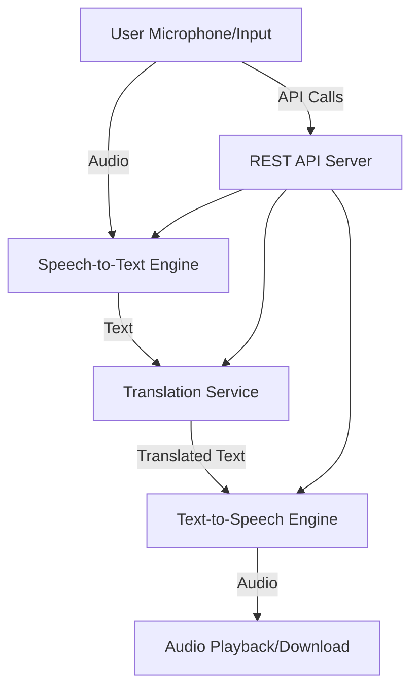

# Speak-Bridge

## Introduction

Speak-Bridge is a versatile voice and language communication platform designed to bridge communication gaps through speech recognition, translation, and synthesis. Built for flexibility and extensibility, Speak-Bridge integrates advanced NLP and speech technologies to offer seamless real-time voice-based interactions, making it ideal for applications requiring multilingual support or voice-command automation.

## Features

- **Real-Time Speech Recognition**  
  Converts spoken language into text instantly with high accuracy. Supports multiple languages and accents.

- **Language Translation**  
  Automatically translates recognized speech or text into various target languages, enabling multilingual communication.

- **Text-to-Speech (TTS) Synthesis**  
  Converts translated or original text back into natural-sounding speech, supporting a wide range of voices and languages.

- **Modular Architecture**  
  Easily extend or replace speech engines, translation providers, or TTS services to match project requirements.

- **API-First Design**  
  Provides RESTful API endpoints for speech input, translation, and synthesis, making integration simple for web, mobile, and IoT apps.

- **User-Friendly Interface**  
  Includes a clean web UI for testing, demonstration, and configuration of language and voice options.

- **Security and Privacy**  
  Manages user data securely and supports authentication for sensitive endpoints.

## Usage

### Installation

Clone the repository and install dependencies:

```bash
git clone https://github.com/pandeji007/Speak-Bridge.git
cd Speak-Bridge
npm install
```

### Configuration

1. Set up environment variables for API keys and service endpoints as required by your selected speech, translation, and TTS providers.
2. Configure supported languages and voice profiles in the `config` files or through the web UI.

### Running the Application

Start the development server:

```bash
npm start
```

The application will launch at `http://localhost:3000` by default.

### Basic Workflow

1. **Speech Input**  
   Use your device microphone or upload an audio file via the web UI or API.

2. **Recognition & Translation**  
   The platform recognizes spoken content, optionally translates it, and displays the resulting text.

3. **Synthesis & Playback**  
   Listen to the translated or original message through TTS playback in your chosen language and voice.

### API Endpoints

Speak-Bridge exposes several RESTful endpoints for integration:

#### Speech-to-Text (STT) Endpoint

##### POST /api/speech-to-text

Transcribes audio data into text.

- **Body:** Audio file (WAV/MP3/OGG)
- **Query params:** `language` (optional)
- **Response:** JSON with recognized text

#### Translation Endpoint

##### POST /api/translate

Translates text between languages.

- **Body:** JSON `{ "text": "Hello", "target": "es", "source": "en" }`
- **Response:** JSON with translated text

#### Text-to-Speech (TTS) Endpoint

##### POST /api/text-to-speech

Synthesizes speech from text.

- **Body:** JSON `{ "text": "Hola", "language": "es", "voice": "female" }`
- **Response:** Audio stream (MP3/WAV)

### Example API Usage

#### Speech-to-Text

```bash
curl -X POST -F "audio=@sample.wav" "http://localhost:3000/api/speech-to-text?language=en"
```

#### Translation

```bash
curl -X POST -H "Content-Type: application/json" \
  -d '{"text": "Hello", "target": "fr", "source": "en"}' \
  http://localhost:3000/api/translate
```

#### Text-to-Speech

```bash
curl -X POST -H "Content-Type: application/json" \
  -d '{"text": "Bonjour", "language": "fr", "voice": "female"}' \
  http://localhost:3000/api/text-to-speech
```

### Web Interface

- Visit `http://localhost:3000` for the demo UI.
- Select input and output languages and voices.
- Record or upload audio, view transcriptions, and listen to synthesized output.

### Extending Speak-Bridge

- **Add Languages:**  
  Update configuration files with new language codes and resource files.
- **Integrate Providers:**  
  Implement new adapters for other speech, translation, or TTS APIs.
- **Custom Workflows:**  
  Chain or combine modules to create advanced, context-aware communication pipelines.

### System Architecture



### Requirements

- Node.js (>=14)
- npm
- Audio hardware for recording/playback (for web UI)
- API credentials for third-party providers (optional, as needed)

### Contributing

- Fork the repository and create pull requests for new features or bug fixes.
- Open issues for feature requests or to report problems.
- Follow coding guidelines and contribute tests when possible.

### License

Speak-Bridge is released under the MIT License.

---

Empower your applications with real-time voice and language capabilities—start using Speak-Bridge today!
